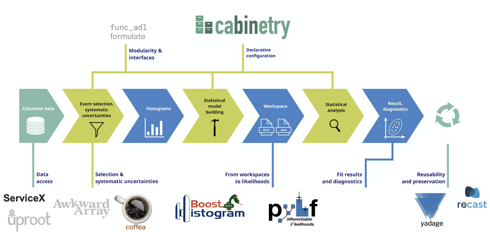
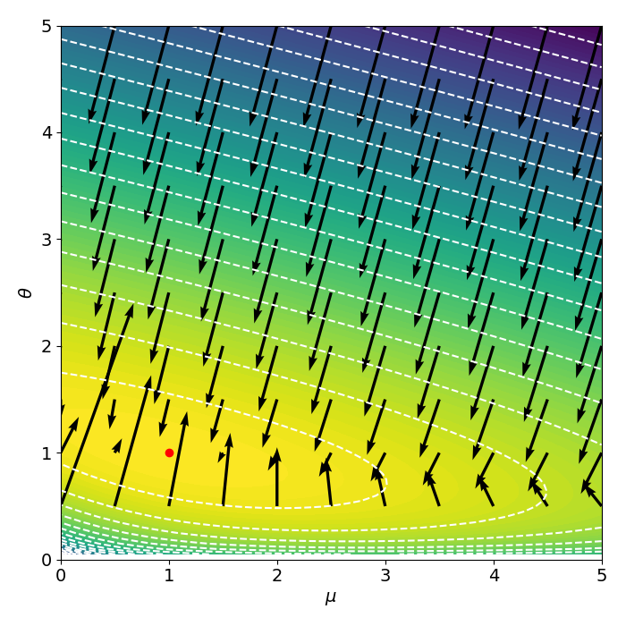
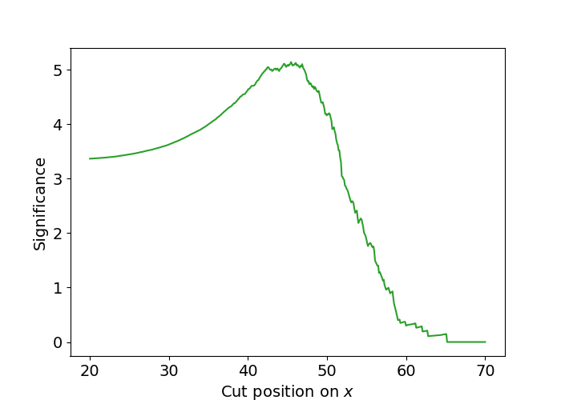
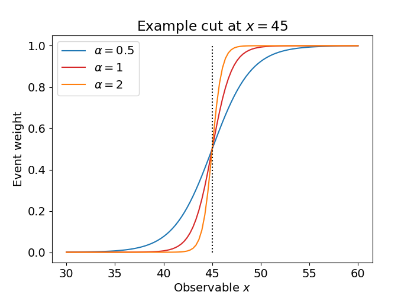
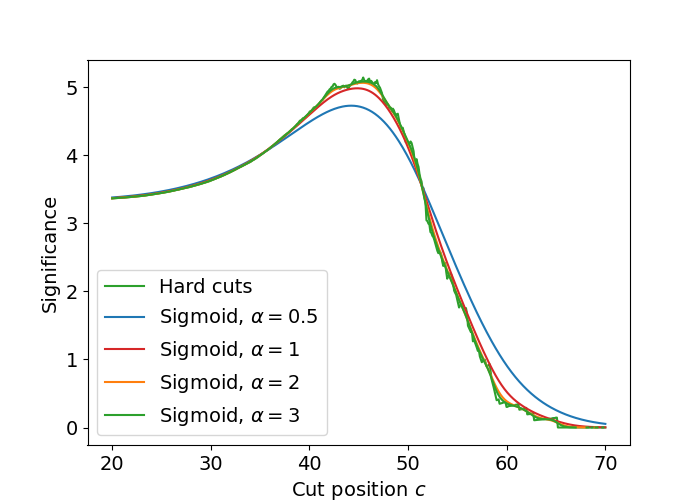
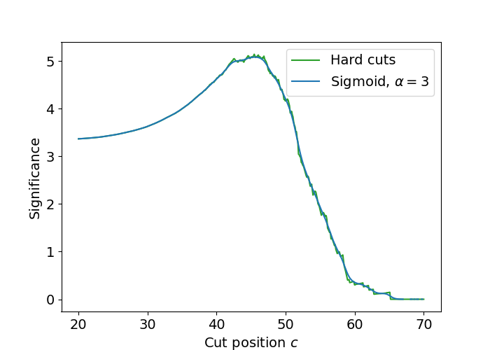
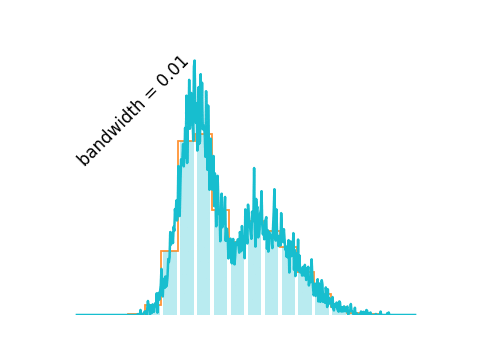
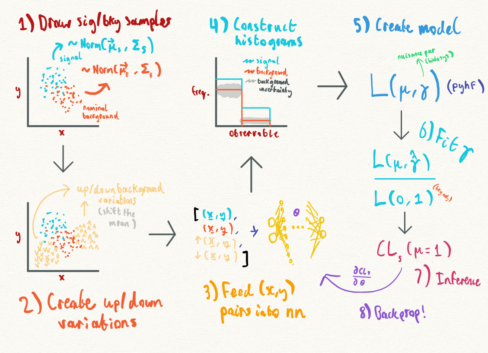

class: middle, center, title-slide
count: false

# Towards Differentiable Physics Analysis
# at Scale at the LHC and Beyond

.huge.blue[Matthew Feickert] 
.huge[(University of Wisconsin-Madison)]
  
[matthew.feickert@cern.ch](mailto:matthew.feickert@cern.ch)

[SNOLAB Seminar Series](FILL IN WHEN HAVE URL)

September 18th, 2023

---
# Talk Notes

* Seminars are held on Mondays at 13:00 Eastern time (12:00 US Central)
* .bold[Talk time:]
   - Talk: 50 minutes
   - Questions: 10 minutes
* .bold[Audience:] audience is quite broad, ranging from undergraduate students to senior scientists
* .bold[Topics:]
   - Data science tools
   - Open source community
   - Building at scale with IRIS-HEP
   - Automatic differentiation
   - Analysis reuse brings wins (RECAST/REANA)
* .bold[Abstract:] As the High-Luminosity Large Hadron Collider (HL-LHC) era looms of horizon for physics analysis at the LHC experiments there are multiple challenges to be overcome to efficiently analyze and extract the most scientific value out of these unique and valuable data. In this seminar I will present a high-level overview of how applications of data science tools from the modern scientific open source community, techniques and applications from the field of automatic differentiation, and strategies for enabling analysis reuse can be leveraged to achieve robust data analysis workflows at the HL-LHC scale. I will also offer proposals for how these tools and techniques can be applied beyond the particle physics community to the broader scientific computing landscape.

<!-- ---
class: focus-slide, center
# Goals for today's discussion

.huge.center.bold[Point out some of the ongoing work that you might be interested in]
 
 
 
.huge.center.bold[Show live (toy) example of how easy it can be to get started] -->

---
# High Energy Physics at the LHC

.kol-1-2.center[

   

.caption[LHC]
]
.kol-1-2.center[

   

.caption[ATLAS]
]
.kol-1-1[
.kol-1-2.center[

   

]
.kol-1-2.center[
.kol-1-2.center[

   

]
.kol-1-2.center[

   

]
]
]

---
# Opportunities and Challenges of the HL-LHC
<!--  -->

   

<!--  -->
.large[
* Increase in luminosity of roughly order of magnitude
   - $3$ - $4$ $\mathrm{ab}^{-1}$ (factor of 20-25 from Run-2 delivered)
* Boon for measurements constrained by statistical uncertainties, searches for rare processes
]

---
# Opportunities and Challenges of the HL-LHC

.center.large[Challenge to be able to .bold[record, store, and analyze] the data]

.kol-1-2[

   

]
.kol-1-2[
 

   

]

.center[[ATLAS](https://cds.cern.ch/record/2803119?ln=en) and [CMS](https://cds.cern.ch/record/2815292?ln=en) software and computing reviews]

---
# IRIS-HEP

.kol-1-2[
.huge[
* Addressing [computing gaps](https://inspirehep.net/literature/2628983) in:
   - Raw resource gaps
   - Scalability of the distributed computing cyberinfrastructure
   - Analysis at scale
   - Sustainability
* LHC experiments as stakeholders
* LHC operations as partners
]
]
.kol-1-2[

   

.caption[Institute for Research and Innovation in Software for High Energy Physics (IRIS-HEP)]
]

---
# IRIS-HEP

.kol-1-1[
.kol-1-2[
.huge[
Designed around [focus areas](https://inspirehep.net/literature/2628983)
]
.large[
* Intellectual Hub
* Analysis Systems
* Data Organization, Management, and Access (DOMA)
* Innovative Algorithms
* Translational Research for AI
* Scalable Systems Laboratory (SSL)
* OSG Services for LHC (OSG-LHC)
]
]
.kol-1-2[
 

   

.caption[IRIS-HEP Institute Structure]
]
]

.large[
community engagement with .bold[training, education, and outreach] and .bold[institute grand challenges]
]

<!-- https://github.com/iris-hep/analysis-grand-challenge/blob/382e512d39e9b62fc4d9da2c69e454dfc718c5f6/docs/index.rst#more-details-what-is-being-investigated-in-the-agc-context -->
---
# IRIS-HEP Analysis Systems

   

.huge[
* Deployable analysis pipelines that physicists time-to-insight
   - Tools integrate into the broader scientific Python computing ecosystem
* Analysis reuse as deployment feature
]

---
# IRIS-HEP Analysis Systems

   

.huge[
* Integrating machine learning training and inference into analysis workflows
   - c.f. [Machine Learning for Columnar High Energy Physics Analysis](https://indico.jlab.org/event/459/contributions/11692/), Elliott Kauffman, CHEP 2023
]

---
# Ecosystems

   

.center.large[
In his [PyCon 2017 keynote](https://youtu.be/ZyjCqQEUa8o), Jake VanderPlas gave us the iconic "PyData ecosystem" image
]

---
# PyHEP ecosystem

   

.center.large[
In his [2022 PyHEP topical meeting update](https://indico.cern.ch/event/1140031/), Jim Pivarski gave us a view for the PyHEP ecosystem
]

---
# Rapid rise of Python for analysis in HEP

   

.center.large["import XYZ" matches in GitHub repos for users who fork [CMSSW](https://github.com/cms-sw/cmssw) by file]

.footnote[[Modern Python analysis ecosystem for High Energy Physics](https://matthewfeickert.github.io/talk-doepy-python-exchange-2022/2022-06-29.pdf), Jim Pivarski, Matthew Feickert, Gordon Watts]

---
# Explosion of Scientific Python (NumPy, etc.)

   

.center.large["import XYZ" matches in GitHub repos for users who fork [CMSSW](https://github.com/cms-sw/cmssw) by library/tool]

.footnote[[Modern Python analysis ecosystem for High Energy Physics](https://matthewfeickert.github.io/talk-doepy-python-exchange-2022/2022-06-29.pdf), Jim Pivarski, Matthew Feickert, Gordon Watts]

---
# Community adoption ...

   

.center.large["pip install XYZ" download rate for MacOS/Windows (no batch jobs) in aggregate]

.footnote[[Modern Python analysis ecosystem for High Energy Physics](https://matthewfeickert.github.io/talk-doepy-python-exchange-2022/2022-06-29.pdf), Jim Pivarski, Matthew Feickert, Gordon Watts]

---
# Community adoption with ecosystem growth

   

.center.large["pip install XYZ" download rate for MacOS/Windows (no batch jobs) by package]
.caption[Aided by interoperable design]

.footnote[[Modern Python analysis ecosystem for High Energy Physics](https://matthewfeickert.github.io/talk-doepy-python-exchange-2022/2022-06-29.pdf), Jim Pivarski, Matthew Feickert, Gordon Watts]

---
# Broader scientific open source collaborations

 

.kol-1-1[
.kol-1-3[

   

]
.kol-1-3[

   

]
.kol-1-3[

   

]
]
<!--  -->
.kol-1-3[
.center.huge[[dask-awkward](https://github.com/dask-contrib/dask-awkward)]

.center[Native Dask collection for partioned Awkward arrays for analysis at scale]
]
.kol-1-3[
.center.huge[[scikit-build-core](https://scikit-build-core.readthedocs.io/)]

.center[Next generation of build tools for scientific packaging]
]
.kol-1-3[
.center.huge[[NumFOCUS](https://numfocus.org/)]

.center[Organizing and supporting scientific open source]
]

---
# Goals of Physics Analysis at the LHC

.kol-1-1[
.kol-1-3.center[
.width-100[]
Search for new physics
]
.kol-1-3.center[
 
.width-100[]

 
Make precision measurements
]
.kol-1-3.center[
.width-110[]

Provide constraints on models through setting best limits
]
]

- All require .bold[building statistical models] and .bold[fitting models] to data to perform statistical inference
- Model complexity can be huge for complicated searches (hundreds of parameters + systematics)
- **Problem:** Time to fit can be .bold[literally days] (for MLE fits, worse if pseudoexperiments required)
- .blue[Goal:] Empower analysts with fast fits and expressive models

---
# Gradients as Computational Tools

- As we'll see later, having access to the gradient while performing minimization is highly beneficial!
- Can imagine multiple ways of arriving at gradients for computational functions
   - But want them to be both .bold[exact] and .bold[flexible]

.center.width-25[]
.kol-6-8[
.bold.center[Symbolic]
.center.width-100[]
]
.kol-2-8.huge[
 
- Exact: .blue[Yes]
- Flexible: .red[No]
]

---
# Gradients as Computational Tools

- As we'll see later, having access to the gradient while performing minimization is highly beneficial!
- Can imagine multiple ways of arriving at gradients for computational functions
   - But want them to be both .bold[exact] and .bold[flexible]

.center.width-25[]
.kol-6-8[
.bold.center[Numeric]
.center.width-70[]
]
.kol-2-8.huge[
 
- Exact: .red[No]
- Flexible: .blue[Yes]
]

---
# Gradients as Computational Tools

- As we'll see later, having access to the gradient while performing minimization is highly beneficial!
- Can imagine multiple ways of arriving at gradients for computational functions
   - But want them to be both .bold[exact] and .bold[flexible]

.center.width-25[]
.kol-6-8[
.bold.center[Automatic]
.center.width-80[]
]
.kol-2-8.huge[
 
- Exact: .blue[Yes]
- Flexible: .blue[Yes]
]

---
# Automatic Differentiation

.kol-3-5[
- Automatic differentiation (autodiff) provides gradients of numerical functions to machine precision
- Build computational graph of the calculation
- Nodes represent operations, edges represent flow of gradients
- Apply the chain rule to operations
   - Can traverse the graph in forward or reverse modes depending on the relative dimensions of input and output for efficient computation

$$
f(a,b) = a^{2} \sin(ab)
$$
 
$$
\frac{df}{da} = \frac{\partial c}{\partial a} \frac{\partial f}{\partial c} + \frac{\partial d}{\partial a} \frac{\partial e}{\partial d} \frac{\partial f}{\partial e}
$$

<!-- TODO: Revise example with graphviz -->
]
.kol-2-5.center[
.width-100[]
]

---
# Automatic Differentiation

* TODO
* Explain forward and backwards modes

---
# Differentiable Programming

 

.grid[
.kol-1-2[
- Allows writing fully differentiable programs that are efficient and accurate
- Resulting system can be optimized end-to-end using efficient gradient-based optimization algorithms
   - Exploit advances in deep learning
- Enables .italic[efficient] computation of gradients and Jacobians
   - Large benefit to statistical inference
- Replace non-differentiable operations with differentiable analogues
   - Binning, sorting, cuts
]
.kol-1-2[
.center.width-100[]
.center[[Snowmass 2021 LOI](https://www.snowmass21.org/docs/files/summaries/CompF/SNOWMASS21-CompF5_CompF3_Gordon_Watts-046.pdf)]
]
]

---
class: focus-slide, center
# Case study: Autodiff improving analyses

.huge.bold.center[Application of autodiff in `pyhf`]

---
# HistFactory Model

- A flexible probability density function (p.d.f.) template to build statistical models in high energy physics
- Developed in 2011 during work that lead to the Higgs discovery [[CERN-OPEN-2012-016](http://inspirehep.net/record/1236448)]
- Widely used by the HEP community for .bold[measurements of known physics] (Standard Model) and  .bold[searches for new physics] (beyond the Standard Model)

.kol-2-5.center[
.width-90[]
.bold[Standard Model]
]
.kol-3-5.center[
.width-100[]
.bold[Beyond the Standard Model]
]

---
# HistFactory Template

$$
f\left(\mathrm{data}\middle|\mathrm{parameters}\right) =  f\left(\vec{n}, \vec{a}\middle|\vec{\eta}, \vec{\chi}\right) = \color{blue}{\prod\_{c \\,\in\\, \textrm{channels}} \prod\_{b \\,\in\\, \textrm{bins}\_c} \textrm{Pois} \left(n\_{cb} \middle| \nu\_{cb}\left(\vec{\eta}, \vec{\chi}\right)\right)} \\,\color{red}{\prod\_{\chi \\,\in\\, \vec{\chi}} c\_{\chi} \left(a\_{\chi}\middle|\chi\right)}
$$

.bold[Use:] Multiple disjoint _channels_ (or regions) of binned distributions with multiple _samples_ contributing to each with additional (possibly shared) systematics between sample estimates

.kol-1-2[
.bold[Main pieces:]
- .blue[Main Poisson p.d.f. for simultaneous measurement of multiple channels]
- .katex[Event rates] $\nu\_{cb}$ (nominal rate $\nu\_{scb}^{0}$ with rate modifiers)
- .red[Constraint p.d.f. (+ data) for "auxiliary measurements"]
   - encode systematic uncertainties (e.g. normalization, shape)
- $\vec{n}$: events, $\vec{a}$: auxiliary data, $\vec{\eta}$: unconstrained pars, $\vec{\chi}$: constrained pars
]
.kol-1-2[
.center.width-100[]
.center[Example: .bold[Each bin] is separate (1-bin) _channel_,  each .bold[histogram] (color) is a _sample_ and share  a .bold[normalization systematic] uncertainty]
]

---
# HistFactory Template

$$
f\left(\vec{n}, \vec{a}\middle|\vec{\eta}, \vec{\chi}\right) = \color{blue}{\prod\_{c \\,\in\\, \textrm{channels}} \prod\_{b \\,\in\\, \textrm{bins}\_c} \textrm{Pois} \left(n\_{cb} \middle| \nu\_{cb}\left(\vec{\eta}, \vec{\chi}\right)\right)} \\,\color{red}{\prod\_{\chi \\,\in\\, \vec{\chi}} c\_{\chi} \left(a\_{\chi}\middle|\chi\right)}
$$

 
Mathematical grammar for a simultaneous fit with

- .blue[multiple "channels"] (analysis regions, (stacks of) histograms)
- each region can have .blue[multiple bins]
- coupled to a set of .red[constraint terms]

 
.center[.bold[This is a _mathematical_ representation!] Nowhere is any software spec defined]
.center[.bold[Until recently] (2018), the only implementation of HistFactory has been in [`ROOT`](https://root.cern.ch/)]

---
# `pyhf`: HistFactory in pure Python

.kol-2-3[
 
- First non-ROOT implementation of the HistFactory p.d.f. template
   - .width-50[]
- pure-Python library with Python and CLI API
  - [`$ pip install pyhf`](https://scikit-hep.org/pyhf/installation.html#install-from-pypi)
  - No dependence on ROOT!
- Open source tool for all of HEP
   - [IRIS-HEP](https://iris-hep.org/projects/pyhf.html) supported Scikit-HEP project
   - Used for reinterpretation in phenomenology paper  (DOI: [10.1007/JHEP04(2019)144](https://inspirehep.net/record/1698425)) and `SModelS`
   - Used in ATLAS SUSY groups and for internal pMSSM SUSY large scale reinterpretation
   - Maybe your experiment too!
]
.kol-1-3.center[
.width-100[]
.width-100[]
]

---
# Open Source Industry Tools for Computation

.grid[
.kol-2-3[
- All numerical operations implemented in .bold[tensor backends] through an API of $n$-dimensional array operations
- Using deep learning frameworks as computational backends allows for .bold[exploitation of autodiff and GPU acceleration]
- As huge buy in from industry we benefit for free as these frameworks are .bold[continually improved] by professional software engineers (physicists are not)

.kol-1-2.center[
.width-90[]
]
.kol-1-2[
 
- Show hardware acceleration giving .bold[order of magnitude speedup] for some models!
- Improvements over traditional
   - 10 hrs to 30 min; 20 min to 10 sec
]
]
.kol-1-4.center[
.width-85[]
.width-85[]
.width-85[]

 
.width-50[]
]
]

---
# Automatic Differentiation of `pyhf` Models

With tensor library backends gain access to _exact (higher order) derivatives_ &mdash; accuracy is only limited by floating point precision

$$
\frac{\partial L}{\partial \mu}, \frac{\partial L}{\partial \theta_{i}}
$$

.grid[
.kol-1-2[
.large[Exploit .bold[full gradient of the likelihood] with .bold[modern optimizers] to help speedup fit!]

  
.large[Gain this through the frameworks creating _computational directed acyclic graphs_ and then applying the chain rule (to the operations)]
]
.kol-1-2[
.center.width-80[]
]
]

---
# HEP Example: Likelihood Gradients

.footnote[Example adapted from [Lukas Heinrich's PyHEP 2020 tutorial](https://indico.cern.ch/event/882824/timetable/#45-introduction-to-automatic-d)]

.kol-1-2.center[

   

]
.kol-1-2.center[

   

]

.bold.center[Having access to the gradients can make the fit orders of magnitude faster than finite difference]

---
# HEP Example: Likelihood Gradients

.footnote[Example adapted from [Lukas Heinrich's PyHEP 2020 tutorial](https://indico.cern.ch/event/882824/timetable/#45-introduction-to-automatic-d)]

.kol-1-2.center[

   

]
.kol-1-2.center[

   

]

.bold.center[Having access to the gradients can make the fit orders of magnitude faster than finite difference]

---
class: focus-slide, center
# Enable new techniques with autodiff

.huge.bold.center[Familiar (toy) example: Optimizing a cut for an analysis]

---
# Discriminate Signal and Background
<!--  -->
* Counting experiment for presence of signal process
* Place discriminate cut on observable $x$ to maximize significance
   - Significance: $\sqrt{2 (S+B) \log(1 + \frac{S}{B})-2S}$ (for small $S/B$: significance $\to S/\sqrt{B}$)

.footnote[Example inspired by Alexander Held's [example of a differentiable analysis](https://github.com/alexander-held/differentiable-analysis-example/)]

.kol-1-2.center[

   

]
.kol-1-2.center[

   

]

---
# Traditionally: Scan across cut values
<!--  -->
- Set baseline cut at $x=0$ (accept everything)
- Step along cut values in $x$ and calculate significance at each cut. Keep maximum.
<!--  -->
.kol-1-2.center[
.width-100[]
]
.kol-1-2[
.width-100[]
]

.center[Significance: $\sqrt{2 (S+B) \log(1 + \frac{S}{B})-2S}$]

---
# Differentiable Approach

.kol-1-2.large[
- Need differentiable analogue to non-differentiable cut
- Weight events using activation function of sigmoid

.center[$w=\left(1 + e^{-\alpha(x-c)}\right)^{-1}$]

- Event far .italic[below] cut: $w \to 0$
- Event far .italic[above] cut: $w \to 1$
- $\alpha$ tunable parameter for steepness
   - Larger $\alpha$ more cut-like
]
.kol-1-2[
 
.width-100[]
]

---
# Compare Hard Cuts vs. Differentiable

.kol-1-2.large[
- For hard cuts the significance was calculated by applying the cut and than using the remaining $S$ and $B$ events
- But for the differentiable model there aren't cuts, so approximate cuts with the sigmoid approach and weights
- Comparing the two methods shows good agreement
- Can see that the approximation to the hard cuts improves with larger $\alpha$
   - But can become unstable, so tunable
]
.kol-1-2.center[
 
.width-100[]
]

---
# Compare Hard Cuts vs. Differentiable

.kol-1-2.large[
- For hard cuts the significance was calculated by applying the cut and then using the remaining $S$ and $B$ events
- But for the differentiable model there aren't cuts, so approximate cuts with the sigmoid approach and weights
- Comparing the two methods shows good agreement
- Can see that the approximation to the hard cuts improves with larger $\alpha$
   - But can become unstable, so tunable
]
.kol-1-2.center[
 
.width-100[]
]

---
# Accessing the Gradient

.kol-2-5.large[
* Most importantly though, with the differentiable model we have access to the gradient
   - $\partial_{x} f(x)$
* So can find the maximum significance at the point where the gradient of the significance is zero
   - $\partial_{x} f(x) = 0$
* With the gradient in hand this cries out for automated optimization!
]
.kol-3-5.center[

   

]

---
# Automated Optimzation

.kol-2-5.large[
* With a simple gradient descent algorithm can easily automate the significance optimization
* For this toy example, obviously less efficient then cut and count scan
* Gradient methods apply well in higher dimensional problems
* Allows for the "cut" to become a parameter that can be differentiated through for the larger analysis
]
.kol-3-5.center[
.width-100[]

<!-- TODO: Make this an animated GIF -->
]

---
# New Art: Analysis as a Differentiable Program
.kol-1-2[
- Provide differentiable analogue to histograms with kernel density estimation (KDE) or softmax
   - Need smooth change compared to abrupt changes in binned yields
<!-- - Make profile-likelihood differentiable with [fixed-point differentiation](https://implicit-layers-tutorial.org/implicit_functions/) -->
- Samples fed into NN that produces observable (NN output) KDE transformed and histogrammed.
- Construct `pyhf` model with observable and perform inference to get $\mathrm{CL}_{s}$ for POI.
- Backpropagate the $\mathrm{CL}_{s}$ to update weights for NN.

 
.center.width-40[]
.footnote[Graphics from [Nathan Simpson's PyHEP 2020 talk](https://indico.cern.ch/event/882824/timetable/#46-neos-physics-analysis-as-a)]
]
.kol-1-2.center[
.width-40[]
.width-100[]
]

---
# New Art: Analysis as a Differentiable Program

.center[`neos` 3 bin KDE transformed observable (NN output) optimized with systematics w.r.t. $\mathrm{CL}_{s}$]
.center.width-100[]

.kol-1-3[
- .neos-orange[Background] and .neos-blue[signal] samples
   - Same colors for dist. / hist.
- 3 decision regions are mappings of NN output
   - $[0.67, 1.0]$ bin $\to$ top left region
]
.kol-1-3[
- From KDE of NN output form `pyhf` model with 1 channel with 2 samples and 3 bins
- $\mathrm{CL}_{s}$ value minimized as goal of NN
]
.kol-1-3[
- Observations in NN output
   - $0$: Background-like
   - $1$: Signal-like
- Binned contents channel input for `pyhf` model
]

---
# Lukas's talk at MODE

* https://indico.cern.ch/event/1242538/contributions/5455218/
* Slide 17 shows that things scale if differentiable

---
# Gordon's talk at MODE

* https://indico.cern.ch/event/1242538/contributions/5432836/
* Shows marrying cuts and DNNs now
* Follow up with Jerry on their question
   - c.f. https://openreview.net/forum?id=JZMR727O29

---
# Differentiable Ecosystem

.kol-1-3.center[
.width-100[]

[gradhep](https://hepsoftwarefoundation.org/activities/differentiablecomputing.html)
]
.kol-1-3.center[
.width-100[]

[neos](https://github.com/gradhep/neos), [INFERNO](https://inspirehep.net/literature/1677673)
]
.kol-1-3.center[
  
.width-100[]

   
[ACTS](https://iris-hep.org/projects/acts.html)
]

 
.kol-1-1[
.bold.center[Groups, libraries, and applications growing rapidly]
]

---
class: focus-slide, center
# Scalable solutions

.huge.bold.center[Differentiable analyses at LHC scale]

---
# Analysis Systems through Lens of Stat Inference

.center.width-80[]

- Accelerating fitting (reducing time to insight (statistical inference)!)
- [Analysis Systems](https://iris-hep.org/as.html) pipeline has beta infrastructure for the final statistical inference stages with [`pyhf`](https://scikit-hep.org/pyhf/) + [`cabinetry`](https://iris-hep.org/projects/cabinetry.html)

---
# Metadiff

.kol-1-3[
- Real world high energy physics analyses have various challenges:
   - Computations highly complex chains
   - Not implementable in a single framework
   - Asynchronous multi-step procedures
   - Strong need for distributed computing
- "Metadiff" allows for passing of gradients .bold[between] different implementations and services
- Possible solution to allow for distributed computations at scale exploiting gradients
]
.kol-2-3.center[
.width-100[]
  
Differentiating through PyTorch, JAX, and TensorFlow using FaaS
]

---
# TODO: Analysis Reuse

* X

---
# Summary

- Automatic differentiation gives a powerful tool in the form of differentiable programming
   - Exploitation of .bold[gradient for optimization]
   - .bold[End-to-end optimization] of systems and analyses
   - Update analysis optimizaiton from .bold[grad]uate student descent to .bold[gradient] descent. &mdash; Matt Bellis
- Scalable workflows are a requirement for LHC scale analyses
   - Distributed .bold[Functions as a Service] offer powerful scaling
   - Heterogeneous architectures can be employed
   - Metadiff can allow for .bold[differentiating across systems] using FaaS
- Ongoing areas of rapid work in IRIS-HEP, gradhep, and CERN
   - Growing .bold[ecosystem] of work and tools

.kol-1-2.center[
.width-45[]
]
.kol-1-2.center[
.width-70[]
]

---
class: end-slide, center

.large[Backup]

---
# Automatic Differentiation: Forward and Reverse

.center[Performing maps $f: \mathbb{R}^{m} \to \mathbb{R}^{n}$]
 
.center[aka, "wide" vs. "tall" transformations]
 
.kol-1-2[
- .bold[Forward] mode
- Column wise evaluation of Jacobian
   - Jacobian-vector products
   - Execution time scales with input parameters
   - Example: few variables into very high dimensional spaces $\mathbb{R} \to \mathbb{R}^{100}$
]
.kol-1-2[
- .bold[Reverse] mode
- Row wise evaluation of Jacobian
   - vector-Jacobian products
   - Execution time scales with output parameters
   - Example: scalar maps from very high-dimensional spaces $\mathbb{R}^{100} \to \mathbb{R}$
]

 
.center[Allows for efficient computation depending on dimensionality]

---
# HistFactory Template

$$
f\left(\mathrm{data}\middle|\mathrm{parameters}\right) =  f\left(\vec{n}, \vec{a}\middle|\vec{\eta}, \vec{\chi}\right) = \color{blue}{\prod\_{c \\,\in\\, \textrm{channels}} \prod\_{b \\,\in\\, \textrm{bins}\_c} \textrm{Pois} \left(n\_{cb} \middle| \nu\_{cb}\left(\vec{\eta}, \vec{\chi}\right)\right)} \\,\color{red}{\prod\_{\chi \\,\in\\, \vec{\chi}} c\_{\chi} \left(a\_{\chi}\middle|\chi\right)}
$$

.bold[Use:] Multiple disjoint _channels_ (or regions) of binned distributions with multiple _samples_ contributing to each with additional (possibly shared) systematics between sample estimates

.kol-1-2[
.bold[Main pieces:]
- .blue[Main Poisson p.d.f. for simultaneous measurement of multiple channels]
- .katex[Event rates] $\nu\_{cb}$ (nominal rate $\nu\_{scb}^{0}$ with rate modifiers)
- .red[Constraint p.d.f. (+ data) for "auxiliary measurements"]
   - encode systematic uncertainties (e.g. normalization, shape)
- $\vec{n}$: events, $\vec{a}$: auxiliary data, $\vec{\eta}$: unconstrained pars, $\vec{\chi}$: constrained pars
]
.kol-1-2[
.center.width-100[]
.center[Example: .bold[Each bin] is separate (1-bin) _channel_,  each .bold[histogram] (color) is a _sample_ and share  a .bold[normalization systematic] uncertainty]
]

---
# HistFactory Template

$$
f\left(\vec{n}, \vec{a}\middle|\vec{\eta}, \vec{\chi}\right) = \color{blue}{\prod\_{c \\,\in\\, \textrm{channels}} \prod\_{b \\,\in\\, \textrm{bins}\_c} \textrm{Pois} \left(n\_{cb} \middle| \nu\_{cb}\left(\vec{\eta}, \vec{\chi}\right)\right)} \\,\color{red}{\prod\_{\chi \\,\in\\, \vec{\chi}} c\_{\chi} \left(a\_{\chi}\middle|\chi\right)}
$$

Mathematical grammar for a simultaneous fit with

- .blue[multiple "channels"] (analysis regions, (stacks of) histograms)
- each region can have .blue[multiple bins]
- coupled to a set of .red[constraint terms]

.center[.bold[This is a _mathematical_ representation!] Nowhere is any software spec defined]
.center[.bold[Until recently] (2018), the only implementation of HistFactory has been in [`ROOT`](https://root.cern.ch/)]

.bold[`pyhf`: HistFactory in pure Python]
.center.width-40[]

---
# What is `pyhf`?

Please checkout the many resources we have starting with the [website](https://scikit-hep.org/pyhf/) and the [SciPy 2020 talk](https://youtu.be/FrH9s3eB6fU)!

<!--  -->

.grid[
.kol-1-3.center[
.width-60[]
]
.kol-1-3.center[
 
.width-60[]
]
.kol-1-3.center[
 
.width-70[]
]
]
---
# References

1. Lukas Heinrich, .italic[[Distributed Gradients for Differentiable Analysis](https://indico.cern.ch/event/960587/contributions/4070325/)], [Future Analysis Systems and Facilities Workshop](https://indico.cern.ch/event/960587/), 2020.
2. Jim Pivarski, .italic[[History and Adoption of Programming Languages in NHEP](https://github.com/jpivarski-talks/2022-02-08-jlab-roundtable-language-history)], [Software & Computing Round Table](https://indico.jlab.org/event/505/#day-2022-02-08), 2022.

---
# References

1. F. James, Y. Perrin, L. Lyons, .italic[[Workshop on confidence limits: Proceedings](http://inspirehep.net/record/534129)], 2000.
2. ROOT collaboration, K. Cranmer, G. Lewis, L. Moneta, A. Shibata and W. Verkerke, .italic[[HistFactory: A tool for creating statistical models for use with RooFit and RooStats](http://inspirehep.net/record/1236448)], 2012.
3. L. Heinrich, H. Schulz, J. Turner and Y. Zhou, .italic[[Constraining $A_{4}$ Leptonic Flavour Model Parameters at Colliders and Beyond](https://inspirehep.net/record/1698425)], 2018.
4. A. Read, .italic[[Modified frequentist analysis of search results (the $\\mathrm{CL}_{s}$ method)](http://cds.cern.ch/record/451614)], 2000.
5. K. Cranmer, .italic[[CERN Latin-American School of High-Energy Physics: Statistics for Particle Physicists](https://indico.cern.ch/event/208901/contributions/1501047/)], 2013.
6. ATLAS collaboration, .italic[[Search for bottom-squark pair production with the ATLAS detector in final states containing Higgs bosons, b-jets and missing transverse momentum](http://inspirehep.net/record/1748602)], 2019
7. ATLAS collaboration, .italic[[Reproducing searches for new physics with the ATLAS experiment through publication of full statistical likelihoods](https://cds.cern.ch/record/2684863)], 2019
8. ATLAS collaboration, .italic[[Search for bottom-squark pair production with the ATLAS detector in final states containing Higgs bosons, b-jets and missing transverse momentum: HEPData entry](https://www.hepdata.net/record/ins1748602)], 2019

---

class: end-slide, center
count: false

The end.
